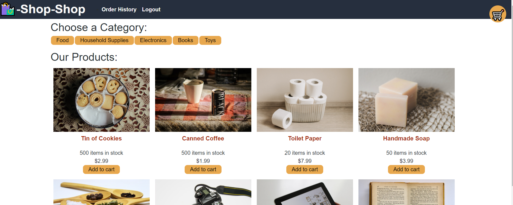

 
# Redux eCommerce Store

### Project Description: eCommerce shopping app that utilizes redux
### Project URL: [https://ericduwe.github.io/reduxStore](https://ericduwe.github.io/reduxStore)
### License Badge: 
## Table of Contents
1. [Technologies Used](#technologies-used)
2. [Installation and Requirements](#installation-and-requirements)
    1. [Prerequisites](#prerequisites)
    2. [How to Install](#installation-instructions)
3. [Usage](#usage)
4. [Contributions](#contributions)
5. [License](#license)
6. [Questions and Contact](#questions-and-contact)

## Technologies Used
redux, react.js, graphql, node.js, apollo, express

## Installation and Requirements
### Prerequisites
N/A

### Installation Instructions
N/A

## Usage

## Contributions
This project is not open to outside contributions at this time.

## License
Distributed under the N/A License. See top of page for more information.

## Questions and Contact
If you have questions regarding this project, contact Eric Duwe at ericduwe@gmail.com, or find me on [github](https://www.github.com/ericduwe).
